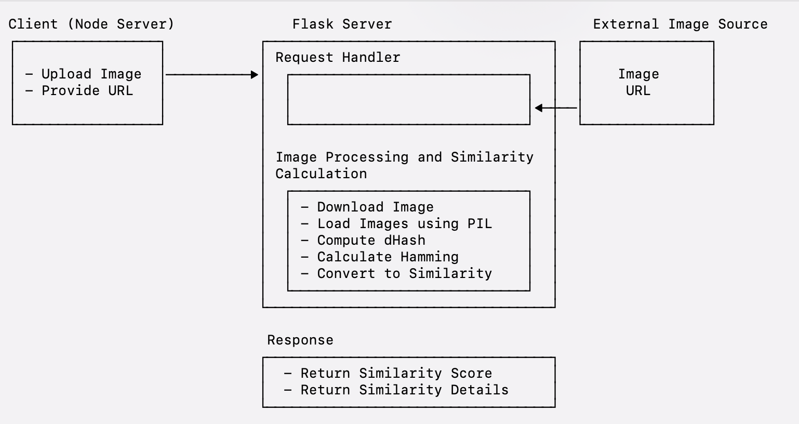

# CSSBattle

Bingyan internship project, a website that uses games to practice CSS.

original website link: https://cssbattle.dev/

## UI

<figure>
    
    <figcaption style="text-align: center; color: gray">Home</figcaption>
</figure>

<figure>
    
    <figcaption style="text-align: center; color: gray">Auth</figcaption>
</figure>

<figure>
    
    <figcaption style="text-align: center; color: gray">Targets List</figcaption>
</figure>

<figure>
    
    <figcaption style="text-align: center; color: gray">Rank</figcaption>
</figure>

<figure>
    
    <figcaption style="text-align: center; color: gray">Play</figcaption>
</figure>

<figure>
    
    <figcaption style="text-align: center; color: gray">Battle</figcaption>
</figure>

## System Architecture

<figure>
    
    <figcaption style="text-align: center; color: gray">Overall System Architecture</figcaption>
</figure>

<figure>
    
    <figcaption style="text-align: center; color: gray">Fe System Architecture</figcaption>
</figure>

<figure>
    
    <figcaption style="text-align: center; color: gray">DB System Architecture</figcaption>
</figure>

<figure>
    
    <figcaption style="text-align: center; color: gray">Be System Architecture</figcaption>
</figure>

<figure>
    
    <figcaption style="text-align: center; color: gray">Algo System Architecture</figcaption>
</figure>
